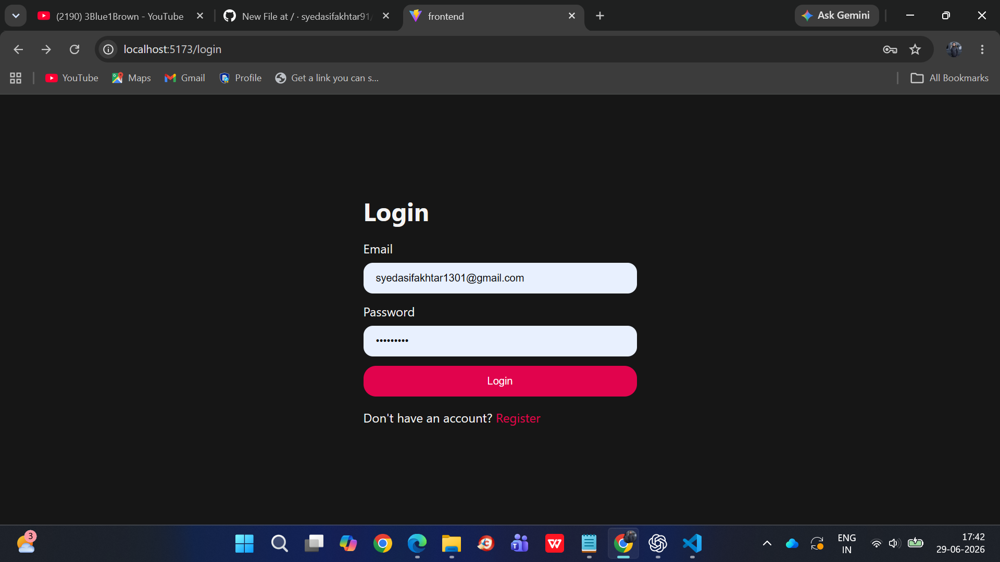
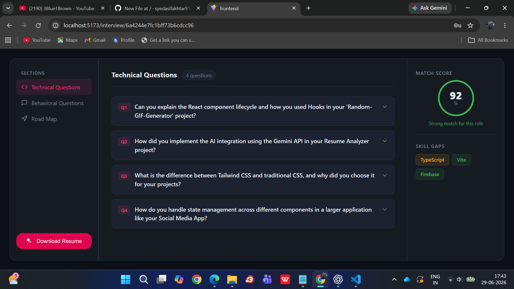

#  AI Resume Analyzer

### AI-Powered Resume Analysis & Interview Preparation Platform

Analyze resumes, match them with job descriptions, identify skill gaps, generate interview preparation reports, and create ATS-friendly resumes using **Google Gemini AI**.


</div>

---

##  Features

-  Resume Upload & Parsing
-  Job Description Matching
-  AI Match Score
-  Technical & Behavioral Interview Questions
-  Skill Gap Analysis
-  Personalized Preparation Plan
-  ATS-Friendly Resume Generation
-  Resume PDF Download
-  JWT Authentication

---

##  Tech Stack

**Frontend**
- React.js
- Vite
- SCSS
- Axios

**Backend**
- Node.js
- Express.js
- MongoDB
- JWT
- Multer

**AI & PDF**
- Google Gemini AI
- Puppeteer
- PDF Parse
- Zod

---

##  Screenshots

###  Login


###  Home


###  Interview Report



---

##  Installation

```bash
git clone https://github.com/syedasifakhtar91/AI_Resume_Analyzer.git

cd Backend
npm install
npm run dev

cd ../Frontend
npm install
npm run dev
```

---

##  Environment Variables

```env
GOOGLE_GENAI_API_KEY=YOUR_API_KEY
MONGODB_URI=YOUR_MONGODB_URI
JWT_SECRET=YOUR_SECRET_KEY
```

---

##  Author

**Syed Asif Akhtar**

GitHub: https://github.com/syedasifakhtar91

---

 **If you found this project useful, consider giving it a Star!**